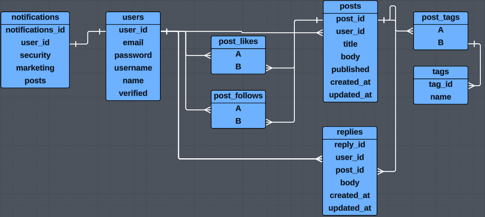

# Chat

### Entity Relational Diagram

## Endpoints

### Users

`/users` - GET, POST  
`/users/:id` - GET, PATCH, DELETE  
`/users/:id/posts` - GET  
`/users/:id/posts-liked` - GET  
`/users/:id/posts-followed` - GET

### Posts

`/posts` - GET, POST  
`/posts/:id` - GET, PATCH, DELETE  
`/posts/:id/likes` - POST, DELETE  
`/posts/:id/follows` - POST, DELETE  
`/posts/:id/replies` - GET, POST

### Replies

`/replies/:id` - GET, PATCH, DELETE

### General Notes

- In prisma, PUT requests implicitly act as PATCH requests and must be made to explicitly change all desired fields in request body.
